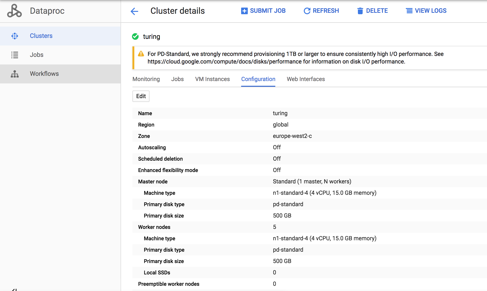

This is a data pipeline that extracts metrics from code respositories at big data scale, using Spark and Python (PySpark).

I deployed and ran the code on Google Cloud Platform using a cluster of 6 VM instances of 1 master and 5 workers, each with 15G RAM and 500G hard disk. The hard disk size is not necessary as the code repositories are less than 50G on disk and another say 40G for storing preprocessed versions. 50% of the disk space are reserved for yarn and HDFS by default.

My folder structure is as follows:

1. turing/code - for storing my Python  codes (in Python 3).
2. turing/csv - for storing CSV file, e.g url_list.csv.
3. turing/preprocessed - for storing preprocessed repositories.
4. turing/raw - for storing downloaded repositories.
5. turing/scripts -for storing bash scripts.
### Preprocessing

After downloading url_list.csv to CSV folder, I cloned the repositories by running the script:

``./script/github.sh``

Some of the repositories are no longer available, which can break the script, so I am timing out the cloning as follows:

``timeout 60s git clone $element.git || true`

The repositories comprise of python files as well as other, but we need only python. Also, it will be convenient access the file as follows *__dir/subdir/\*.py__*. All this is handled by running:

``./scripts/preprocessing.sh``

After this, I still observed that we have filename that will be difficult to work with, which can be easily fixe using **detox** utility.

`detox -r preprocessed ``

I also used ``./scripts/remove_header.sh`` to remove the header in url_list.csv so that we can only have the list of repositories.

### Storage

For easy access during processing, I copied the files to Google Storage bucket using:

``gsutil -m cp -r preprocessed/ gs://dataproc-7f343af3-d3ec-4d8a-a85f-13d7f2501053-europe-west2``

The script is in **scripts/copy_storage.sh**.

To check the number of folders copied successfully to Google Storage run:

``./scripts/gs_foldercount.sh``

### Execution

The code doing the main processing is MetricsWithSpark.py and it is executed in Google Cloud as follows:

``gcloud dataproc jobs submit pyspark ../code/MetricsWithSpark.py --cluster=turing --properties "spark.pyspark.python=python3,spark.pyspark.driver.python=python3"``

Or you can simply run:

``./scripts/submit_job.sh``.

### Improvement
Fetching each repository from Google Cloud Storage Bucket is not a good idea because of too much latency. Hence, it would be better to load all the data into memory at once using ``sc.wholeTextFiles()``.

